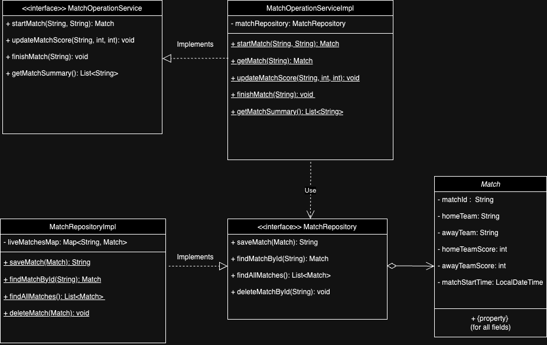

# Live-Football-World-Cup-Score-Board

## Description
This lightweight Java library provides real-time tracking and scoring for live football matches, offering instant match summaries. Developed with an emphasis on clean architecture, Test-Driven Development (TDD), and adherence to SOLID principles.

## Table of Contents
- [Architecture](#Architecture)
- [Installation](#Installation)
- [Usage](#Usage)
- [Run Test](#run-the-tests)


### Architecture


### Installation

1. ***Prerequisites***:

   Make sure the following installed:

   . Java 21

   . Maven 3+

2. ***Clone the Repository***:

To get a copy of the project on your local machine, run:

```bash
git https://github.com/asishjac/Live-Football-World-Cup-Score-Board.git

```

3. ***Build the project***:

Navigate into the project directory:

```bash
cd LiveFootballWorlCupScoreboard
```
Build the project using your preferred build tool:

- For Maven

```bash
mvn clean verify
```

### Usage
1. **Running the Application**:

This is intended to use as a library.To start the application,

```bash
java -jar target/scoreboard-app-{version}.jar
```

### Run the tests
1. **Unit Tests**: Run unit tests to verify functionality.

- Using Maven

 ```bash
mvn test
```